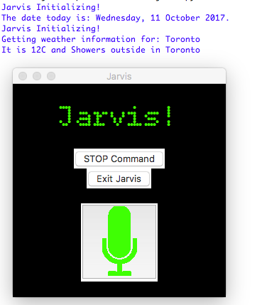

# Jarvis

Jarvis is an automated assistant that is created on Python 3. 
Jarvis can:
- Play Music
- Translate from English
- Give current weather conditions
- Give movie/tv show ratings
- Surf the web
- Give information on the EPL.

Modules Used:
>1. speech_recognition: Used for speech recognition (Reqires pyAudio and pySpeech)
>2. pyglet: Used for playing media
>3. yweather: Used for getting weather information (Yahoo Weather)
>4. microsofttranslator: Used for translating from English
>5. tmdbsimple: Used for Movies and TV Shows' information

